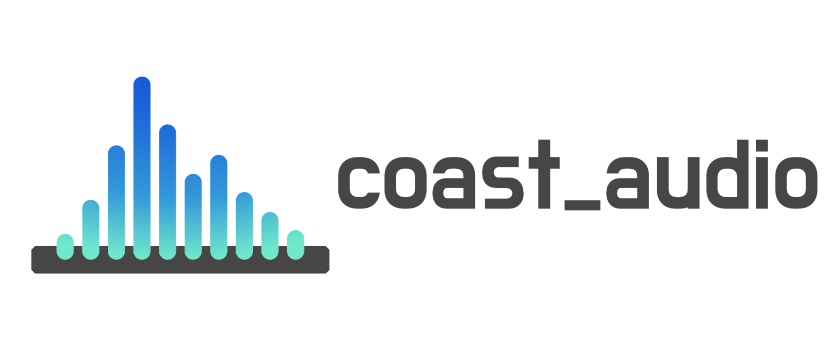
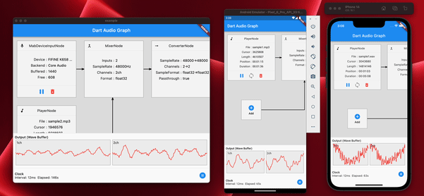

# coast_audio
[](https://codecov.io/gh/SKKbySSK/coast_audio)





`coast_audio` is a high performance audio processing library written in Dart.\
This package aims to provide low-level audio functionalities with **no Flutter dependency**.

## Features

- Audio Buffer Management
- Ring Buffer Management
- Audio Node Graph System
  - Decoder Node
  - Mixer Node
  - Function Node
  - Volume Node
- Encoding and Decoding mechanism
  - Wav Audio Encoder/Decoder
- Wave Generation
  - Sine
  - Triangle
  - Square
  - Sawtooth
- Audio Device I/O
  - Playback
  - Capture
- Audio Format Management and Conversion

## Supported Platforms

| Android | iOS | macOS | Windows | Linux | Web |
| ------- | --- | ----- | ------- | ----- | --- |
| ✅      | ✅  | ✅    | ⚠️      | ✅    | ❌  |

- **Windows** is not tested but it should work if the native library is compiled correctly.

## How It Works

`coast_audio` is built on top of `dart:ffi`.\
Thus, it can be used in **any Dart environment** that supports FFI.

Some of the functionalities are implemented in native code which uses [miniaudio](https://miniaud.io).\
This repository contains pre-built binaries for each supported platform.

## Installation

Add the following to your `pubspec.yaml`:

```yaml
coast_audio: ^1.0.0
```

### Android

1. Create a new directory `android/src/main/jniLibs` in your project.
2. Copy the `{ABI}/libcoast_audio.so` file from the `native/prebuilt/android` directory to the `jniLibs` directory.

### macOS/iOS

Add the following to your `Podfile`:

```ruby
target 'Runner' do
  ...
  pod 'CoastAudio', :git => 'https://github.com/SKKbySSK/coast_audio.git', :tag => '1.0.0':
end
```

Open the `AppDelegate.swift` file and add the following import and initialization:

```swift
import CoastAudio // 1. Add import

@UIApplicationMain
@objc class AppDelegate: FlutterAppDelegate {
  override func application(
    _ application: UIApplication,
    didFinishLaunchingWithOptions launchOptions: [UIApplication.LaunchOptionsKey: Any]?
  ) -> Bool {
    CoastAudioSymbolKeeper.keep() // 2. Add this line to prevent native symbols from being stripped
    GeneratedPluginRegistrant.register(with: self)
    return super.application(application, didFinishLaunchingWithOptions: launchOptions)
  }
}

```

### Linux

1. Copy the `{ARCH}/libcoast_audio.so` file from the `native/prebuilt/linux` directory to the `linux/libs` directory in your project.
2. Add the following to your `linux/CMakeLists.txt`:

```cmake
install(FILES "linux/libs/${CMAKE_SYSTEM_PROCESSOR}/libcoast_audio.so" DESTINATION "${INSTALL_BUNDLE_LIB_DIR}" COMPONENT Runtime)
```

### Windows

TODO

There is no pre-built native library for Windows yet.\
You need to build it manually.

## Usage

### Generate Sine Wave

`coast_audio` provides various audio nodes to generate/process audio data easily.\
This example code generates a 440hz sine wave by using `FunctionNode`.

```dart
// define the audio format with 48khz sample rate and stereo channels.
final format = AudioFormat(sampleRate: 48000, channels: 1, sampleFormat: SampleFormat.int16);

// create a sine wave function node with 440hz frequency.
final functionNode = FunctionNode(
  function: const SineFunction(),
  frequency: 440,
);

AllocatedAudioFrames(length: 1024, format: format).acquireBuffer((buffer) {
  // read the audio data from the function node to the buffer.
  functionNode.outputBus.read(buffer);

  // floatList contains sine wave audio data.
  final floatList = buffer.asFloat32ListView();
});
```

### Generate Wav File

You can use `WavAudioEncoder` to encode audio data.

```dart
// define the audio format with 48khz sample rate and stereo channels.
final format = AudioFormat(sampleRate: 48000, channels: 1, sampleFormat: SampleFormat.int16);

// create a sine wave function node with 440hz frequency.
final functionNode = FunctionNode(
  function: const SineFunction(),
  frequency: 440,
);

final fileOutput = AudioFileDataSource(
  file: File('output.wav'),
  mode: FileMode.write,
);

// create a wav audio encoder.
final encoder = WavAudioEncoder(dataSource: fileOutput, inputFormat: format);

encoder.start();

final duration = AudioTime(10);
AllocatedAudioFrames(length: duration.computeFrames(format), format: format).acquireBuffer((buffer) {
  // read the audio data from the function node to the buffer.
  final result = functionNode.outputBus.read(buffer);

  // encode the audio data to the wav file.
  encoder.encode(buffer.limit(result.frameCount));
});

encoder.finalize();
```

### Mixing Audio with Audio Node Graph System

`AudioNode` can be connected to other nodes to build an audio graph.\
This example code demonstrates how to mix two sine waves and write to a wav file.

```dart
const format = AudioFormat(sampleRate: 48000, channels: 1);
final mixerNode = MixerNode(format: format);

// Initialize sine wave nodes and connect them to mixer's input
for (final freq in [264.0, 330.0, 396.0]) {
  final sineNode = FunctionNode(function: const SineFunction(), format: format, frequency: freq);
  final mixerInputBus = mixerNode.appendInputBus();
  sineNode.outputBus.connect(mixerInputBus);
}

AllocatedAudioFrames(length: 1024, format: format).bufferFrames.acquireBuffer((buffer) {
  // read the audio data from the function node to the buffer.
  functionNode.outputBus.read(buffer);

  // floatList contains mixed sine wave audio data.
  final floatList = buffer.asFloat32ListView();
});
```

### Play, record and loopback

`coast_audio` provides `AudioDevice` class to handle audio device I/O.\
Please see the following examples:

- Play audio from a file: [player_isolate.dart](example/lib/isolates/player_isolate.dart)
- Record audio to a file: [recorder_isolate.dart](example/lib/isolates/recorder_isolate.dart)
- Loopback audio from input to output: [loopback_isolate.dart](example/lib/isolates/loopback_isolate.dart)

## Q&A

### Can I use this package in Flutter?

Yes, you can use `coast_audio` in Flutter.

Most of `coast_audio` operation is synchronous and it may block the Flutter's main isolate.\
So, it is recommended to use `coast_audio` in a separate isolate.

Please see the [example](example) app implementation for more details.

### Can I use `coast_audio` in web?

In short, no,\
You should use `dart:web_audio` instead.\
But it may become available if the FFI is supported on the Web platform.
